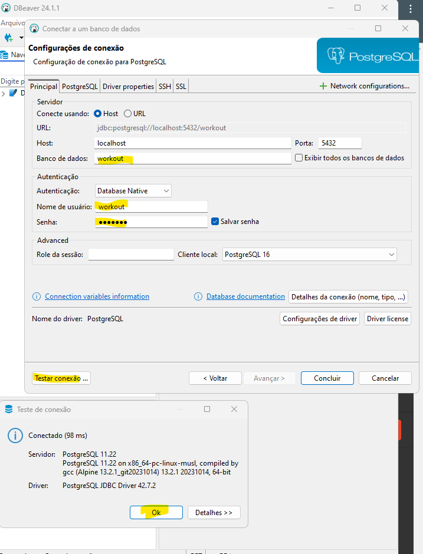

<h1>Desenvolvendo sua primeira API com FastAPI, Python e Docker</h1>
Instrutora: Nayanna Nara


Sumário:

- [Repositório Oficial do Lab](#repositório-oficial-do-lab)
- [💻Recursos utilizados](#recursos-utilizados)
- [Desafio final](#desafio-final)
  - [Anotações](#anotações)
    - [Criação do ambiente virtual](#criação-do-ambiente-virtual)
      - [Ambiente virtual usando virtualenv](#ambiente-virtual-usando-virtualenv)
      - [Ambiente virtual usando Pyenv](#ambiente-virtual-usando-pyenv)
  - [Instalação das dependências](#instalação-das-dependências)
  - [Testando o servidor](#testando-o-servidor)
  - [Makefile](#makefile)
  - [Declarative Base do SQLAlchemy](#declarative-base-do-sqlalchemy)
  - [UUID do SQL Alchemy](#uuid-do-sql-alchemy)
  - [Alembic](#alembic)
  - [Requirements](#requirements)
  - [asyncpg](#asyncpg)
- [Docker-compose](#docker-compose)


# Repositório Oficial do Lab

Repo da workout_api: [https://github.com/digitalinnovationone/workout_api](https://github.com/digitalinnovationone/workout_api)

# 💻Recursos utilizados

[FastAPI](https://fastapi.tiangolo.com/)(async): framework moderno, rápido de alto desempenho, fácil de aprender, rápido de codar e pronto para produção voltado para construir APIs com Python.

[uvicorn](https://pypi.org/project/uvicorn/): Uvicorn é uma implementação de servidor web ASGI para Python. A especificação ASGI preenche essa lacuna e significa que agora podemos começar a construir um conjunto comum de ferramentas utilizáveis ​​em todas as estruturas assíncronas.Documentação: [https://www.uvicorn.org/](https://www.uvicorn.org/)

[alembic](https://pypi.org/project/alembic/): Alembic é uma ferramenta de migração de banco de dados escrita pelo autor de SQLAlchemy . Uma ferramenta de migração oferece as seguintes funcionalidades. Documentação: [https://alembic.sqlalchemy.org/en/latest/](https://alembic.sqlalchemy.org/en/latest/)

[SQLAlchemy](https://pypi.org/project/SQLAlchemy/): SQLAlchemy é o kit de ferramentas Python SQL e mapeador relacional de objetos que oferece aos desenvolvedores de aplicativos todo o poder e flexibilidade do SQL. SQLAlchemy fornece um conjunto completo de padrões de persistência de nível empresarial bem conhecidos, projetados para acesso eficiente e de alto desempenho ao banco de dados, adaptados em uma linguagem de domínio simples e Pythonica.
Documentação: [https://www.sqlalchemy.org/](https://www.sqlalchemy.org/)

[pydantic](https://pypi.org/project/pydantic/): Validação de dados usando dicas de tipo Python. Artigo de referência: [Pydantic: Simplifying Data Validation in Python](https://realpython.com/python-pydantic/)

[PostgresSQL](https://www.postgresql.org/): PostgreSQL é um poderoso sistema de banco de dados relacional de objeto de código aberto com mais de 35 anos de desenvolvimento ativo que lhe rendeu uma forte reputação de confiabilidade, robustez de recursos e desempenho.

[Docker](https://www.docker.com/): Docker é uma plataforma de software que permite criar, implantar e gerenciar aplicações em contêineres. Um contêiner é uma unidade leve, portátil e autosuficiente que inclui tudo o que a aplicação precisa para rodar: código, runtime, bibliotecas e dependências do sistema. Ele permite o isolamento da aplicação, é portável, escalável e permite a integração com sistemas CI/CD para automatizar o desenvolvimento.

Python 3.12.3 e ambiente virtual Venv.

# Desafio final

```txt
1 - adicionar query parameters nos endpoints
    - atleta
        - nome
        - cpf
2 - customizar response de retorno de endpoints
    - get all
        - atleta
            - nome
            - centro_treinamento
            - categoria
3 - Manipular exceção de integridade dos dados em cada módulo/tabela
    - sqlalchemy.exc.IntegrityError e devolver a seguinte mensagem: “Já existe um atleta cadastrado com o cpf: x”
    - status_code: 303
4 - Adicionar paginação utilizando a lib: fastapi-pagination
    - limit e offset
```

## Anotações

### Criação do ambiente virtual
A seguir você encontra duas opções para criar seu ambiente virtual usando:
* virtualenv ou
* pyenv

#### Ambiente virtual usando virtualenv

Nativo do Python a partir da versão 3.3.

Criação do ambiente virtual via CMD:

```txt
py -m venv .venv_workout
```

Ativação do ambiente virtual via CMD:

```txt
.venv_workout\Scripts\activate
```

#### Ambiente virtual usando Pyenv
É necessário instalar o [Pyenv](https://pypi.org/project/pyenv/) previamente. Depois execute no cmd o comando a seguir. Nele você pode especificar a versão do Python que será utilizada, seguido do nome do ambiente.
Instalação do pyenv para Windows:
[https://github.com/pyenv-win/pyenv-win](https://github.com/pyenv-win/pyenv-win) - instruções no Quick Start. Atenção! Abra o Power Shell como Admin para executar o comando de instalação, depois feche e abra novamente para continuar.

Instalação do pyenv no Windows usando Power Shell:
```txt
Invoke-WebRequest -UseBasicParsing -Uri "https://raw.githubusercontent.com/pyenv-win/pyenv-win/master/pyenv-win/install-pyenv-win.ps1" -OutFile "./install-pyenv-win.ps1"; &"./install-pyenv-win.ps1"
```

Depois de instalar o pyenv, você deve criar as variáveis de ambiente. Use os comandos a seguir no Power Shell:
```txt
[System.Environment]::SetEnvironmentVariable('PYENV', "$HOME\.pyenv\pyenv-win", 'User')
[System.Environment]::SetEnvironmentVariable('PATH', "$env:PYENV\bin;$env:PYENV\shims;$env:PATH", 'User')
```
Para testar se o comando pyenv está sendo reconhecido:
```txt
pyenv --version
```
Criação do ambiente no projeto:
```txt
pyenv virtualenv 3.11.4 workoutapi
```

Para ativar o ambiente virtual criado use o comando a seguir também no cmd, onde workoutapi é o nome do ambiente criado.

```txt
pyenv activate workoutapi
```

## Instalação das dependências
Depois de ativar o ambiente virtual, execute o comando a seguir no CMD para instalar de uma só vez todos os pacotes necessários para o início da api. Pode ser que outros sejam utilizados mais adiante.

```txt
pip install fastapi uvicorn sqlalchemy pydantic
```

## Testando o servidor
Utilize o comando a seguir no CMD para subir o servidor:

```txt
uvicorn diretorio.arquivo:app
```
No nosso exemplo seria:

```txt
uvicorn workout_api.main:app
```

O CMD deve exibir uma mensagem de sucesso com o link a seguir:

```txt
http://127.0.0.1:8000
```

Você também poderá acessar a documentação através do link a seguir, mas no começo do projeto, ela estará vazia.
```txt
http://127.0.0.1:8000/docs
```

## Makefile
O arquivo Makefile não tem extensão.

Para funcionar corretamente, o arquivo Makefile precisa estar no mesmo nível da pasta do projeto. Este projeto está na pasta workout_api.

No presente projeto temos a seguinte estrutura:
```txt
📁 desafio-projeto-07-primeira-api
    📁 .venv_workout
    📁 workout_api
    ⚙️ Makefile
    📑 README.md
```
Caso o arquivo Makefile estivesse dentro da pasta workout_api, por exemplo ocorreria o erro:

```txt
make: *** No rule to make target 'run'.  Stop.
```
Exemplo de comando criado no Makefile:

```txt
run:
	@uvicorn workout_api.main:app --reload

```

Para executar o comando exemplificado acima, use a palavra make acompanhada do nome do comando. Se estiver trabalhando em um ambiente virtual, lembre-se de ativá-lo primeiro. No CMD digite:

```
make run
```

## Declarative Base do SQLAlchemy

O declarative_base do SQLAlchemy é uma função que serve como uma base para a definição de classes de modelos ORM (Object-Relational Mapping). Essas classes representam tabelas no banco de dados. O uso do declarative_base permite que você defina as tabelas e suas relações de maneira declarativa e orientada a objetos.

Ao usar o declarative_base, você cria uma classe base a partir da qual todas as suas classes de modelo irão herdar. Isso fornece uma maneira padronizada de definir tabelas do banco de dados como classes Python.

As classes definidas usando declarative_base são automaticamente mapeadas para tabelas no banco de dados. Você define atributos de classe que correspondem às colunas da tabela e o SQLAlchemy cuida do resto.

Documentação: [https://docs.sqlalchemy.org/en/20/orm/mapping_api.html#sqlalchemy.orm.DeclarativeBase](https://docs.sqlalchemy.org/en/20/orm/mapping_api.html#sqlalchemy.orm.DeclarativeBase)


## UUID do SQL Alchemy
O UUID (Universally Unique Identifier) do SQLAlchemy é um tipo de dado utilizado para armazenar identificadores únicos que são globalmente únicos. Esses identificadores são úteis para garantir que cada entrada em uma tabela de banco de dados tenha um identificador único que não colida com outros, mesmo em diferentes bancos de dados ou sistemas distribuídos.
Ao definir uma coluna em uma tabela do banco de dados com SQLAlchemy, você pode especificar que ela deve ser do tipo UUID. Vantagens:
* Unicidade Global: Garante que cada ID seja único em todo o mundo.
* Segurança: UUIDs são difíceis de prever, aumentando a segurança em alguns contextos.
* Descentralização: Útil em sistemas distribuídos onde diferentes partes do sistema precisam gerar IDs únicos sem coordenar com um servidor central.

## Alembic
Alembic é uma ferramenta de migração de banco de dados usada em conjunto com SQLAlchemy. Ele permite gerenciar e aplicar alterações na estrutura do banco de dados de maneira controlada e incremental, facilitando a evolução do esquema do banco de dados ao longo do tempo sem perder dados.

Alembic ajuda a manter o esquema do banco de dados sincronizado com as definições do modelo em seu código. Isso é particularmente útil em projetos onde o esquema do banco de dados está em constante evolução.
Permite criar arquivos de migração que documentam as alterações no esquema do banco de dados, como adição ou remoção de tabelas e colunas, alteração de tipos de dados, e muito mais.

Cada migração criada pelo Alembic é versionada, o que significa que você pode aplicar, reverter ou refazer migrações específicas. Isso facilita o controle de versões do esquema do banco de dados, especialmente em equipes de desenvolvimento colaborativo.
Para utilizar é preciso fazer a instalação previamente:

```txt
pip install alembic
```

Ativação do Alembic:

```txt
alembic init alembic
```
Instalação do asyncpg:

```txt
pip install asyncpg
```

Depois de rodar o container Docker e configurar o DBeaver para a conexão com o Postgres, alterar o arquivo env.py dentro do Alembic.

## Requirements

O arquivo requirements.txt é um arquivo utilizado em projetos Python para listar todas as dependências (bibliotecas e pacotes) necessárias para executar o projeto. Este arquivo permite que outras pessoas ou sistemas configurem o ambiente adequado para rodar o projeto de maneira fácil e consistente.

Ele especifica todas as bibliotecas que o projeto depende, junto com suas versões, garantindo que o ambiente de desenvolvimento seja consistente em diferentes máquinas. Usar o requirements.txt simplifica a instalação das dependências com um único comando, facilitando a configuração do ambiente.

```txt
pip freeze > requirements.txt
```

## asyncpg
'asyncpg' é uma biblioteca Python de alto desempenho para trabalhar com bancos de dados PostgreSQL de forma assíncrona. Ela é projetada para uso com o framework asyncio, que permite a escrita de código assíncrono em Python, proporcionando maior eficiência e escalabilidade em aplicações que lidam com operações de I/O intensivas, como consultas a bancos de dados.

'asyncpg' é otimizado para ser mais rápido que outras bibliotecas de PostgreSQL para Python, como psycopg2. Ele utiliza uma implementação de protocolo otimizada e técnicas de redução de overhead para alcançar um desempenho superior.

Sendo uma biblioteca assíncrona, asyncpg permite que você realize consultas ao banco de dados sem bloquear a execução do programa. Isso é particularmente útil em aplicações web, servidores, e outras aplicações onde a latência e a capacidade de resposta são críticas.

Ele suporta várias funcionalidades avançadas do PostgreSQL, incluindo tipos de dados avançados, índices, e operações de alto desempenho.

```txt
pip install asyncpg
```

# Docker-compose

Abra o terminal. Ative o ambiente virtual e digite o comando a seguir:

```txt
docker-compose up -d
```

Se ocorrer algum erro, verifique se o serviço Docker está ativo e se o wsl está atualizado e funcional.

Depois de iniciar o container, abra o DBeaver e configure a conexão Postgres com os mesmos dados do 'docker-compose.yml'.

```txt
environment:
      POSTGRES_PASSWORD: workout
      POSTGRES_USER: workout
      POSTGRES_DB: workout
```
No nosso exemplo o banco de dados, o usuário e a senha se chamam workout.
No DBeaver clique em Nova Conexão ou 'CTRL + SHIFT + N' >> selecione o Postgres e preencha os campos conforme exemplo a seguir:
```txt
Banco de dados: workout
Usuário: workout
Senha: workout
```
Depois teste a conexão en se estiver tudo certo, clique em 'Concluir'.




